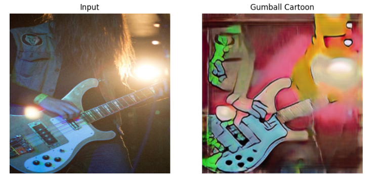

# 🎨 Cartoonify CycleGAN — Real Photo → Cartoon Style Transfer

This project implements a **two-stage CycleGAN** that transforms real photos into high-quality cartoon-style images.  
Stage A trains a 256px model to learn coarse style features, and Stage B fine-tunes the model at 512px to add sharper edges, cleaner colors, and more consistent cartoon textures.

The project includes:
- Custom **ResNet-based generators**
- **PatchGAN discriminators**
- Full **cycle-consistency**, **identity**, and **adversarial** loss pipeline
- Mixed-precision (AMP) training
- Dataset cleaning scripts
- Sample results
- Training logs

---

## 📸 Results — Before & After

| Real → Cartoon | 
|----------------|
  

More examples available in the `samples/` folder.

---

## 🧠 Model Architecture

### **CycleGAN Overview**
The model consists of two cycles:

- **G: Real → Cartoon**
- **F: Cartoon → Real**  
- **D_X:** Discriminator for real images  
- **D_Y:** Discriminator for cartoon images  

Two full cycles are enforced using **cycle-consistency loss**.

### **Generator**
- ResNet-based architecture
- 9 residual blocks (for 256/512 resolution)
- Instance normalization
- Reflection padding
- Learned to preserve structure while applying cartoon textures

### **Discriminator (PatchGAN)**
- 70×70 PatchGAN
- Classifies overlapping patches for more stable GAN training
- Produces sharper edges and avoids over-smoothing

---

## 🔥 Loss Functions

| Loss | Description |
|------|-------------|
| **Adversarial Loss** | Makes generated images indistinguishable from real cartoon images |
| **Cycle Loss** | Forces G and F to be inverses (preserve structure) |
| **Identity Loss** | Prevents unnecessary color shifting |
| **Total Loss** | `adv + λ_cycle * cycle + λ_id * id` |

**Stage A Hyperparameters**  
- `λ_cycle = 10`  
- `λ_id = 5`  

**Stage B Hyperparameters**  
- `λ_cycle = 10`  
- `λ_id = warmup → 0` (for stronger stylization)

---

## ⚙️ Training Pipeline

### **Stage A — 256px Pretraining**
- Focus on structure + rough style
- Helps stabilization before high-resolution training

### **Stage B — 512px Finetuning**
- Produces final cartoon quality
- Stronger color flattening
- Sharper outlines and textures

---

## 📈 Training Logs

All logs are in `logs/`.

Example (D/G/Cycle losses over epochs):

